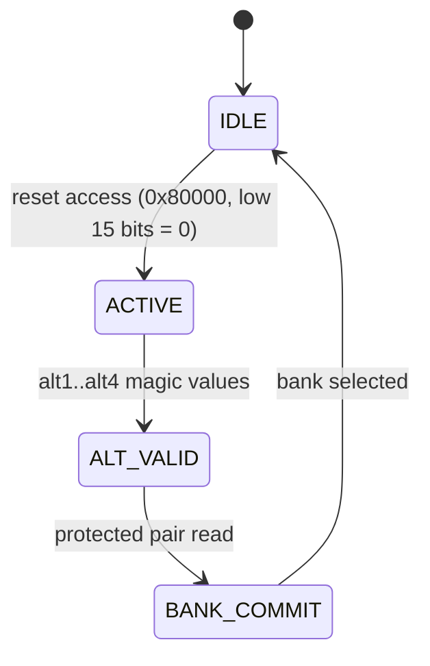

# Finding an undocumented Atari Slapstic side-channel by differential debugging in TypeScript

*Draft for a standalone article. Working copy — not published.*

---

A 126-byte mismatch in a playfield buffer, at exactly one frame, turned out to be
a 40-year-old hardware security chip leaking state through the CPU's instruction
prefetch. Here is how a function-by-function reimplementation of *Marble Madness*
(Atari, 1984), checked against MAME byte for byte, surfaced a behavior that is not
in the MAME source or any datasheet I could find.

## The project, briefly

[Marble Love](https://github.com/magno73/marble-love) is a from-scratch
reimplementation of Marble Madness in TypeScript. It is not an emulator. Instead
of running the 68010 machine code on an instruction core, each routine of the
game program is **ported function by function** from the disassembly into
readable TypeScript, and then checked against MAME as a behavioral oracle.

Two deliberate choices make the rest of this story possible:

- **Source-level, not cycle-accurate.** The goal is a legible model of the
  gameplay code tied to evidence, not a timing-exact emulator. We guarantee the
  *observable state* (the bytes written to work RAM, the playfield, sprite and
  alpha RAM) matches at the verified points, and the *order* of side effects;
  we do not promise cycle-exact bus timing.
- **MAME as the oracle.** MAME already runs the original ROM faithfully. So for
  any frame we can dump its RAM and compare ours against it, byte by byte. That
  comparison is the engine of every discovery here.

Most retro reimplementations sit at one of two extremes. An **emulator** runs the
real machine code and is faithful by construction, but the gameplay logic stays
locked inside opaque instruction execution — you can run it, not read it. A
**visual clone** is readable but invents its own logic, so it is only as accurate
as someone's eyeballs. The function-by-function approach is a third option: the
code is as legible as a clone, but every routine is pinned to the original's
observed behavior. The cost is real — you port and verify hundreds of routines by
hand — but the payoff is that the gameplay is *both* readable *and* checkable. The
rest of this post is one thing that falls out of that combination. Musashi (a
68000/68010 core) is also wired in as a per-subroutine oracle, so individual ports
can be diffed against the real instruction semantics in isolation, not just at the
whole-frame level.

## What a slapstic is

Atari System 1 cartridges protect part of their program ROM with a custom chip
called a **slapstic** (Marble Madness uses the `137412-103`). It bank-switches a
32 KB region (`0x080000`–`0x087FFF`, four 8 KB banks) and, crucially, it is a
little state machine that *watches the addresses the CPU reads* in that window.
A specific dance of reads — a "reset" access, then magic `alt` values, then a
final read from a protected address pair — is what selects a bank. Copy the ROM
without reproducing the dance and you get the wrong bank, which is exactly the
point: it is a 1980s anti-piracy device.

To reimplement the game we modeled this chip as an FSM driven by the addresses
our port "accesses":



MAME implements the same FSM. So the two should agree — and for a long time, in
the region that mattered, they did.

## The anomaly

The workflow for a hard divergence is blunt and effective. Pick a frame, dump
both sides, diff the RAM:

```sh
# our state vs MAME at a target frame, byte for byte
TARGET_FRAME=12950 npx tsx packages/cli/src/probe-diff-bytes.ts
```

At frame 12950 a residual would not close: **126 bytes** of difference in the
playfield RAM, concentrated in the tile-rendering descriptors the game rebuilds
that frame. (Downstream, by f13200, the same root cause had grown to 414 bytes.)
Everything upstream matched. The routine that produced those descriptors read
from the slapstic-banked region — so the suspicion was immediate: we were
committing a different bank than the hardware.

But our slapstic FSM was a faithful port. It observed the protected window
exactly as documented: reset, alt, protected pair. The protected reads alone
produced bank *N*; MAME, from the same protected reads, was using bank *M*.

## The discovery

The leap was to stop trusting the documented window. On a 68010, the CPU does
**instruction prefetch**: it fetches ahead of the program counter. Those fetches
are real bus accesses with real addresses — and the slapstic FSM is wired to the
bus, not to the game's intentions.

We logged every address the CPU's prefetch touched around the divergence and
fed those into the FSM as well. One of them lit up: the prefetch of address
`0x02ff5a`, inside `FUN_2FF40`, **matches the slapstic's `alt1` pattern** — and
it happens *before* the protected pair (`0x87a28` → `0x87a48 + idx*2`) is read.
That stray prefetch nudges the FSM into a different state, so the *same*
protected reads then commit a *different* bank.

In other words: the chip observes CPU prefetch **outside** its protected ROM
window, and that observation changes the bank it selects. It is a hardware side
channel. It is not described in the MAME source (MAME happens to reproduce the
effect because it models the bus accesses, but it does not call it out), and I
could not find it in any public slapstic datasheet or write-up.

Modeling the prefetch into our FSM closed the 126-byte diff at f12950 and the
414-byte diff at f13200 to zero.

```sh
# the regression test that pins the FSM, including the prefetch path
npx vitest run packages/engine/test/slapstic-103.test.ts   # 12/12
```

## The method, generalized

Nothing about this was clever in isolation. It was the loop:

1. **Have an oracle.** MAME runs the real ROM. Any divergence is a fact, not an
   opinion.
2. **Diff state, not output.** Comparing rendered frames hides the cause;
   comparing the *bytes the program wrote* points straight at the routine.
3. **Bisect to a frame and a routine.** The first frame that differs, and the
   buffer it differs in, name the suspect.
4. **Distrust the documentation at the point of contradiction.** The port was
   "correct" by the datasheet. The datasheet was incomplete. The bus said so.
5. **Re-pin with a test.** A discovery you cannot re-run is a story; one you can
   is a regression test.

A readable port is what makes step 4 affordable. When the suspect routine is a
page of TypeScript you can read against the disassembly — rather than opaque
emulator internals — "what address would the real CPU touch here, and who is
watching the bus?" becomes a question you can actually chase.

## It generalizes: a second finding

One discovery is luck; two is a method. The same readability that exposed the
slapstic side channel also explains gameplay quirks that have nothing to do with
hardware.

The trackball routine (`FUN_00025DF6`) reads the per-frame trackball delta,
scales it, and applies it to the marble's position. Reading the port, the final
step is a single branch on the game's mode byte (`0x400394`, equal to
`level - 1`):

```ts
if (gameState === 4) {            // game mode 4 = the Silly Race (level 5)
  pos += (delta << 11);           // add
} else {
  pos -= (delta << 11);           // every other level subtracts
}
```

Adding rather than subtracting the same delta **inverts the marble's response**.
That one branch is the entire "the marble fights you" feel of Marble Madness's
gag level: same physics, same input pipeline as every other level, with one sign
flip keyed on the level number. A decades-old gameplay gimmick reduced to a
branch you can point at — and a [parity test](../../packages/engine/test/trackball-apply.test.ts)
that makes the claim checkable rather than anecdotal.

The slapstic finding is a hardware secret; this is a design detail. Both came out
of the same loop, which is the point: a faithful, legible model lets you ask
"why does the game do *this*?" and answer it with a line number.

## On the workflow behind it

Much of this reimplementation, including the differential-debugging loops, was
driven with an LLM agent in the loop. That is a tool, not the point. The
interesting artifact is not "AI wrote a game"; it is that a faithful,
*evidence-checked* model of a 1984 program is legible enough that a 40-year-old
hardware quirk falls out of a byte diff. The agent loop helped sustain the
tedious diff-bisect-explain cycle; the oracle and the tests are what make any of
it trustworthy.

## Try it / read more

- Repo: <https://github.com/magno73/marble-love>
- What is bit-perfect vs behavioral vs heuristic, with a command to verify each:
  [`docs/STATUS.md`](../STATUS.md)
- The finding, with exact addresses and commits:
  [`docs/findings/slapstic-prefetch-side-channel.md`](../findings/slapstic-prefetch-side-channel.md)

You need your own legally dumped ROMs to run it; the repo ships no game assets.

---

*Reproducibility note: the commands above were run against the repo at draft
time. `slapstic-103.test.ts` reports 12/12; the byte-diff probe and the slapstic
fix commit (`4a5d27b`) are in the history.*
